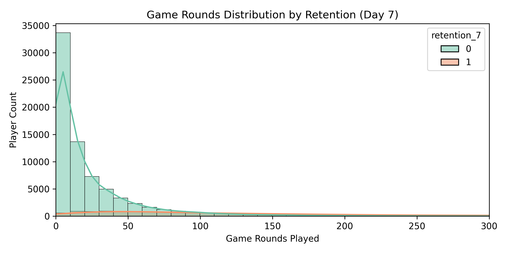
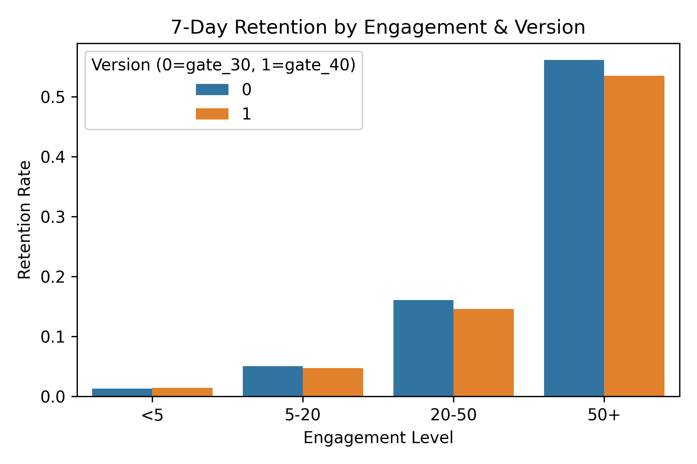
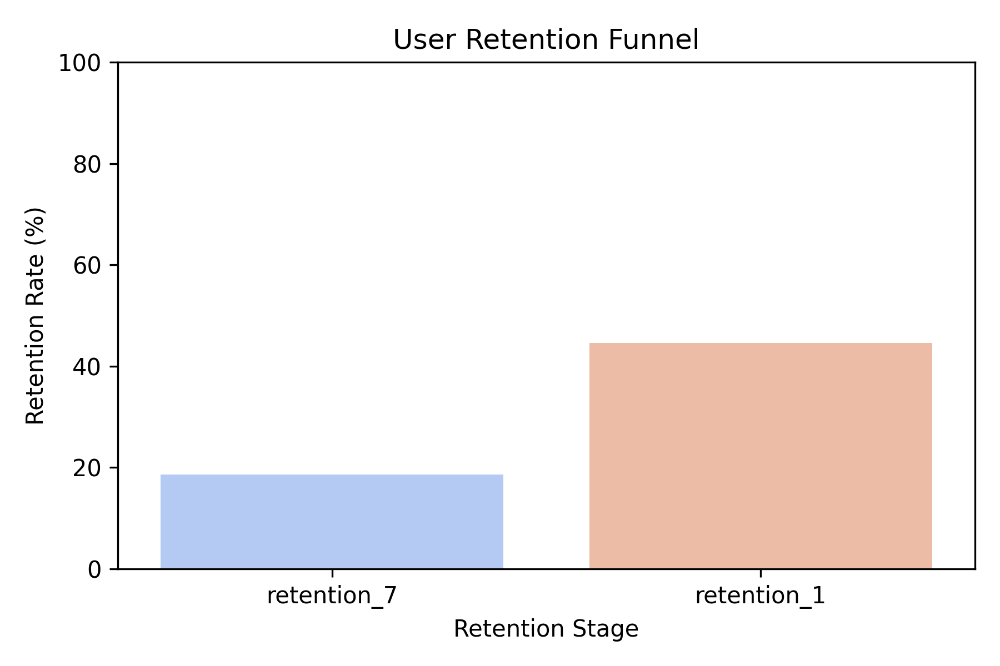
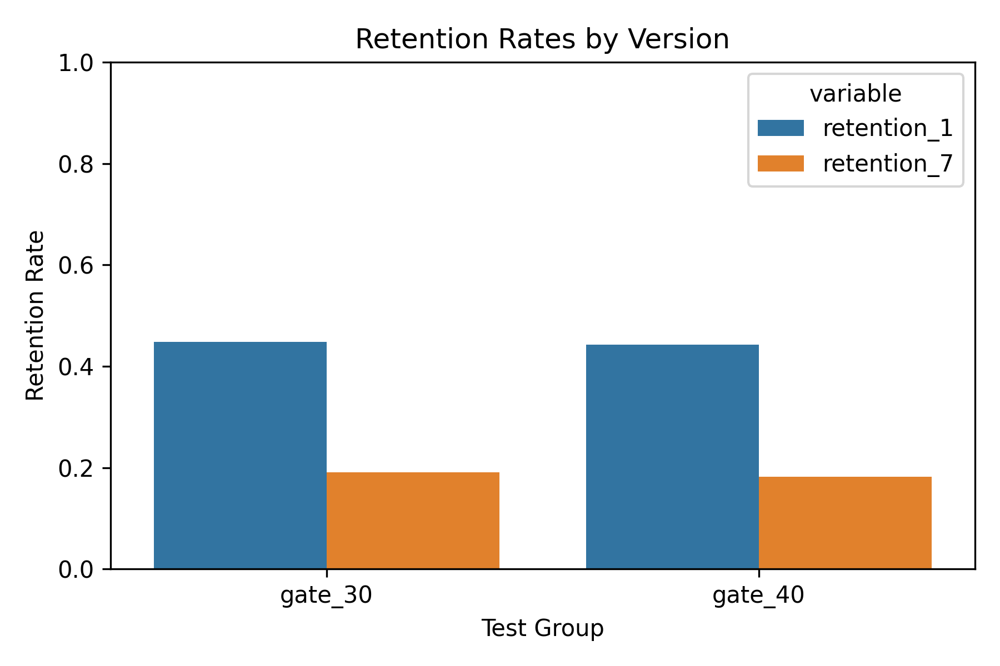
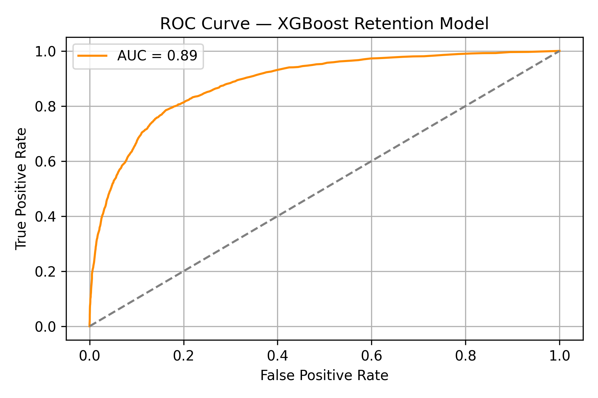
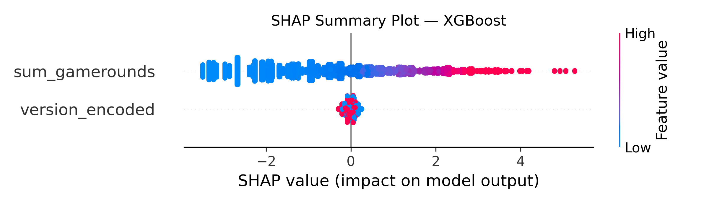

# In-Game Ad Timing Optimization through Retention Modeling

This project analyzes player behavior from a mobile puzzle game to determine the optimal timing for in-game advertisements that maximizes retention without compromising monetization. The analysis combines A/B testing, statistical testing, behavioral segmentation, and explainable machine learning to provide actionable recommendations to product and monetization teams.

---

## Objective

To identify how early in-game ad placement impacts user retention. Specifically, the project investigates whether displaying ads after level 1 (gate_30) versus level 2 (gate_40) affects short- and long-term player engagement, with the goal of optimizing ad strategy based on user behavior.

---

## Dataset

The dataset consists of 90,000+ user sessions from the game "Cookie Cats," with each user randomly assigned to one of two test groups:
- `gate_30`: Ads shown after level 1
- `gate_40`: Ads shown after level 2

Features include:
- Total number of game rounds played (`sum_gamerounds`)
- Binary retention indicators for Day 1 (`retention_1`) and Day 7 (`retention_7`)
- Test group assignment (`version`)

---

## Methodology

1. **Exploratory Data Analysis**
   - Segmented users by early engagement level
   - Visualized gameplay distributions and retention funnels
   - Identified behavioral thresholds for retention

2. **A/B Testing**
   - Performed chi-squared test on Day 7 retention rates between test groups
   - Result: Statistically significant difference (p = 0.0016), favoring later ad display

3. **Retention Modeling**
   - Trained an XGBoost classifier to predict 7-day retention
   - Model evaluation:
     - Accuracy: 87.0%
     - Precision: 71.2%
     - Recall: 50.6%
     - ROC AUC: 0.886

4. **SHAP Explainability**
   - Applied SHAP to understand the impact of `sum_gamerounds` and `version_encoded` on retention predictions
   - Local explanation showed that low-engagement users had significantly lower predicted retention probabilities

---

## Results and Insights

- **Engagement is the dominant driver of retention**. Only 1.3% of users who played fewer than 5 rounds returned after 7 days.
- **Highly engaged users (>50 rounds)** had a 7-day retention rate of 54.8%.
- **Ad timing has a measurable but secondary impact**. Users in the `gate_40` group retained slightly better than those in `gate_30`, with a statistically significant difference.
- SHAP confirmed that retention is primarily determined by early gameplay behavior, not test group alone.

---

## Recommendations

- Do not show ads to users who play fewer than 5 rounds. These users are highly likely to churn and should not be disrupted.
- Consider delaying ads for high-engagement users to preserve long-term retention.
- Implement dynamic ad logic based on real-time engagement thresholds.

---

## Visual Summary

**Game Rounds vs Retention (7-Day)**  

**Retention by Engagement and Test Group**  

**Retention Funnel**  

**Retention by A/B Group**  

**ROC Curve (XGBoost)**  

**SHAP Feature Importance**  

---

## Tools and Technologies

- Python, Pandas, NumPy
- Seaborn, Matplotlib
- Scikit-learn, XGBoost
- SHAP, SciPy
